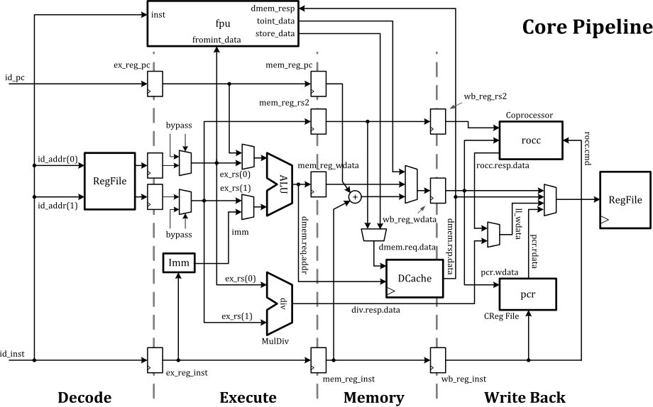

## case class RocketCoreParams
- sets parameters to the rocket core, lazily evaluated 
- extends `CoreParams` from `tile/Core.scala`

## class RocketCustomCSRs
Not read yet

## class Rocket
- generates IO using `HasCoreIO`, with parameter from `HasRocketCoreParameters`
- `NoChiselNamePrefix` for avoiding RocketImpl being prefixed
- `XX_reg_YY`: instantiates XX stage registers named YY

<!--#### PC gen & Fetch Stage-->

#### Decode Stage
- `decode_table`: a mapping of Instructions -> List of control signals which are assigned into `id_ctrl` Wire.
- `def decodeReg`: extracts regfile addresses from instruction. Also checks whether the instruction is legal with appropriate number of registers (if RVE 16, else 32).
- `rf`: instatiates a RegFile. 31 entries RV32, 15 entries in RVE, each with `xLen` width.
- `id_rs`: contains rs1, rs2 values read from the RegFile
- CSRFile (Control Status Register File): not read yet
- SCIEDecoder (SiFive Custom Instruction Extension Decoder): not read yet
- BPU (Breakpoint Unit): not read yet
- Picks the highest priority (exception, cause) from various sources(`csr`, `bpu`, `FrontendResp`,`id_illegal_inst`) and store it into `(id_xcpt, id_cause)`
- Detect bypass opportunities
  - `bypass_sources`는 EX, MEM stage에서 write하는 instrcution인지, write address, 해당하는 wdata를 IndexedSeq에 저장한다.
  - EX, MEM stage에서 write을 하는 instruction인지와 write address가 현 ID stage의 read address가 같은지를 판단하여 bypass 필요여부를 `id_bypass_src`에 넣어둔다

#### Execute Stage
- `bypass_mux`: map bypassed data from `bypass_sources`
- `ex_rs` : for each rs, yield a mux to select bypassed data indexed by rs_lsb or original rs data
- `ex_op1` and `ex_op2` : select which operands to use (rs1/pc, rs2/imm/size)
  - size is used for JAL instruction to indicate the next pc. (either pc+4 or pc+2)
- `alu` : instantiate a alu module with injecting io signals (dw(double word), fn(function), in2, in1)
- `div` : instantiate a MulDiv module (when `pipelinedMul` is turned off then set mulUnroll to 0)
- `mul` : instantiate a pipelinedMul module
- `when(!ctrl_killd)` 
  - `when(id_fence...)` : @TODO
  - `when(id_xcpt)` : deals with different `id_xcpt` causes and configure ALU to send specific data down the writeback pipeline.  
  For xcpts in FrontendResp and BPU (`xcpt0`, `xcpt1`, `bpu.io.xcpt_if`), send corresponding PC, PC+2 down the pipeline to Exception Program Counter (EPC) TODO: 'bpu.io.xcpt_if'  
  For other xcpts causes, send the instruction (configured as rs1 + 0). 
- `ex_reg_mem_size := id_inst(0)(13,12)` : [13:12] bit field represents log2 of data width in Bytes (00: 8bit(LB), 01: 16bit(LH), 10: 32bit(LW)) ([14] bit field represents unsigned memory operation) 

- `do_bypass` : checks whether bypassing needed
- `bypass_src` : select the source to bypass by PriorityEncoder (prioritized in order of x0 -> mem_wdata -> wb_wdata -> D$data)
- `ex_reg_rs_lsb` and `ex_reg_rs_msb` : When bypassing occurs, assign bypass source to lsb and ignore msb. Otherwise, pass through original rs.
- `when (id_illegal_insn)` : store the instruction in rs1
- `ctrl_killx` : checks whether to replay inst in ex stage // TODO: put in a control flow diagram
- `ex_slow_bypass` : set flag of slow bypassing when it takes 2 cycles to use data from LB/LH/SC (sign extension in WB stage?)

#### Memory Stage
- `mem_br_target` : which branch target to jump (taken branch's target, JAL target, or next PC)
- `mem_npc` : if jalr or sfence (@TODO), get encoded Virtual Address (@TODO), else get branch target. Then AND with -2 (=1111...110), to make the PC a multiple of 2. 
    - More into Virtual Address: (with default option, PAddr=32, v=39, and XLen=64) : unmatched with spec - Why?  +  sign extend with VA and zero extend with PA, why? (SOS to prof. Gwangsun Kim..? or ask to snu arch class prof!)
- `mem_wrong_npc`: (When using branch predictor) checks 
- `mem_direction_misprediction` : 
- `mem_misprediction` : 
- `take_pc_mem` : 

### class Scoreboard
- keeps information about the (long-latency) instructions being executed. The register has to be kept reserved until the instruction is finished thus invoking the set method. When instruction finishes, it clears the bit.
- set(en: Bool, addr: UInt): updates the bit of the sboard
- clear(en: Bool, addr: UInt): clears the bit of the sboard
- read(addr: UInt): reads sboard content

## class RegFile
- arguments: `(n: Int, w: Int, zero: Boolean = false)`
  - `xLen` as width `w`
  - `regAddrMask` as entry number `n`: 15 if `useRVE (embedded)` else 31
- used to make register file of the core
- rf is implemented as Mem(n, w)
- `read(addr: UInt)`: reads from certain register
- `write(addr: UInt, data: UInt)`: supports forwarding (when `wb_waddr == id_radder`, other cases are dealt using `bypass_sources`)

